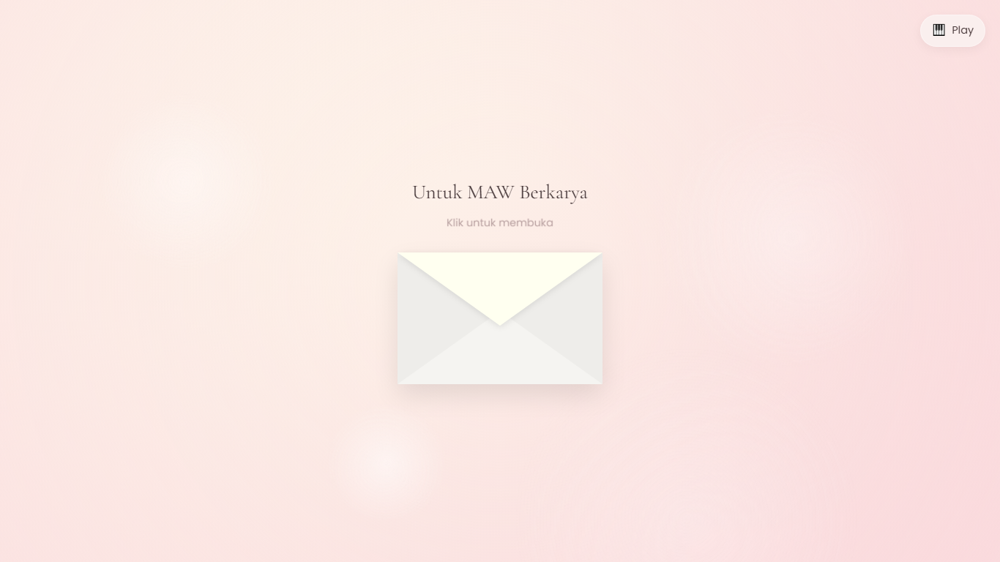
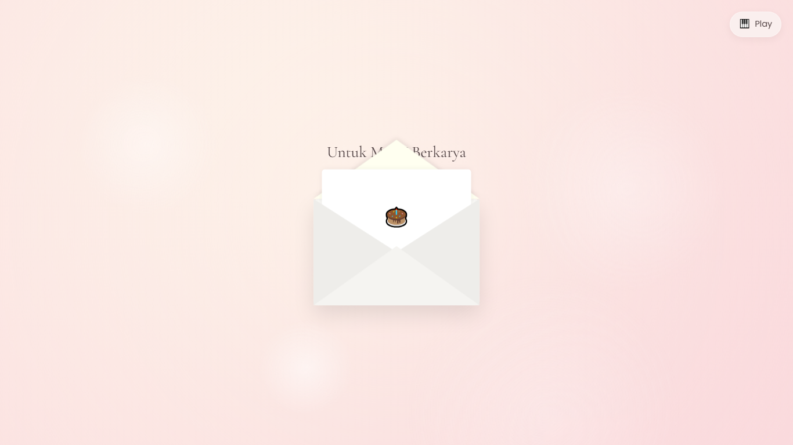
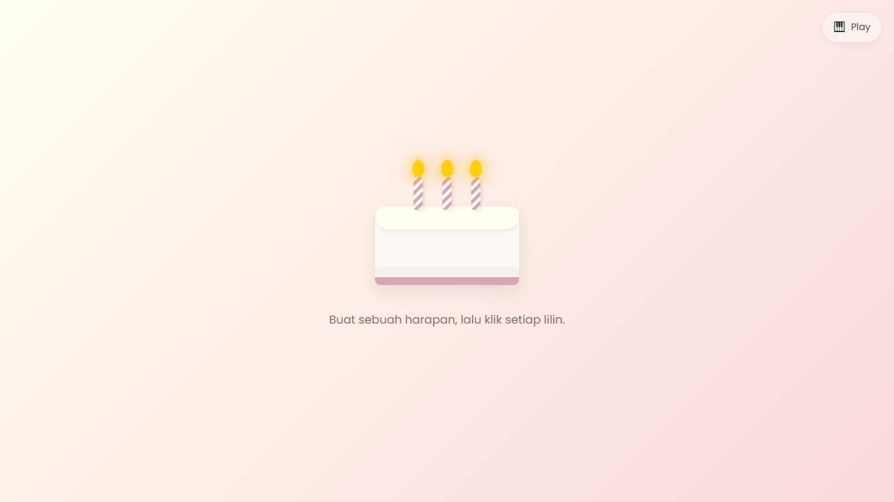
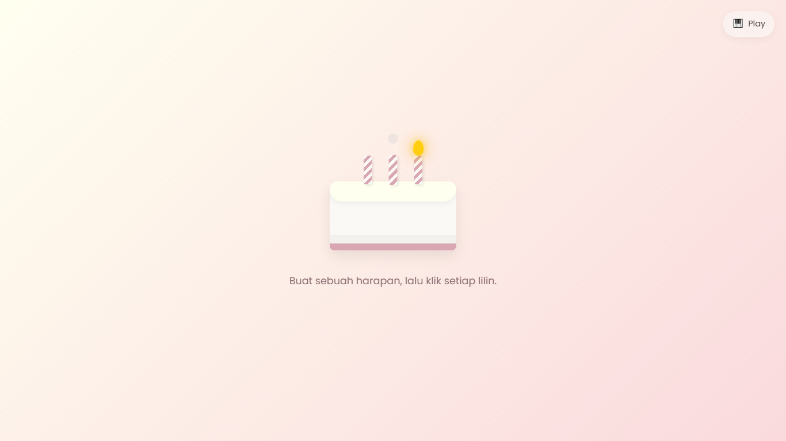
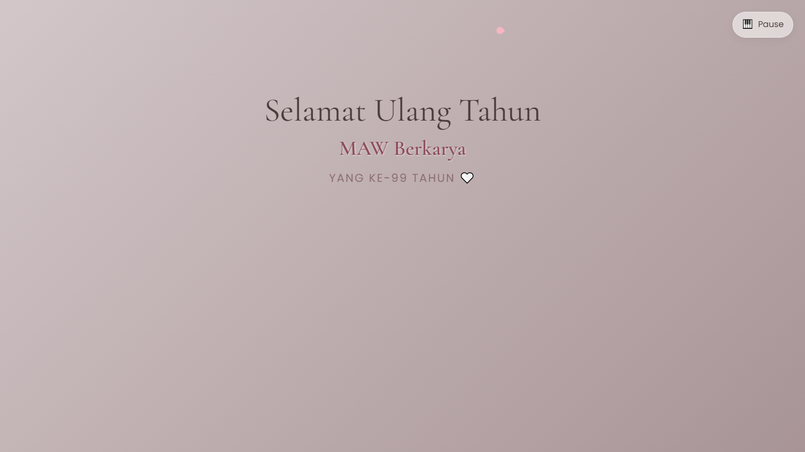
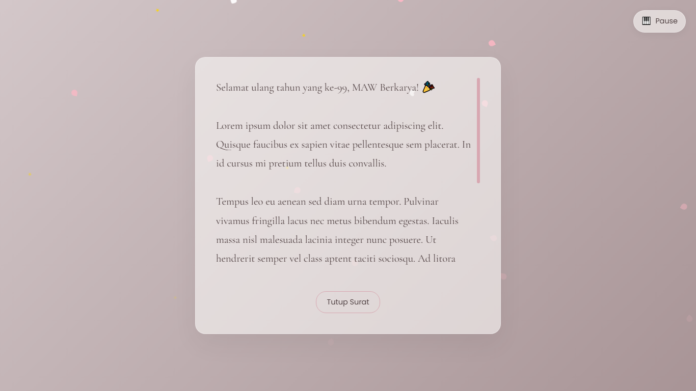

# 🎂 Interactive Birthday Greeting Website

An interactive birthday greeting website built with **HTML**, **CSS**, and **Vanilla JavaScript**. This project presents a memorable birthday experience through multiple animated scenes, complete with background music, interactive elements, and a heartfelt birthday letter.

---

## 📸 Preview

### 🏠 Home


### 💌 Opening the Envelope


### 🎂 Birthday Cake


### 🕯 Blow Out the Candles


### 🎉 Birthday Celebration


### 💖 Birthday Letter


---

## ✨ Features

- 💌 Animated envelope opening
- 🎂 Interactive birthday cake with clickable candles
- 🕯 Candle blow-out animation and smoke effects
- 🎉 Birthday surprise transition
- 💖 Falling particle effects (hearts, sakura, and sparkles)
- ✍️ Typing animation for the birthday letter
- 🎵 Background music player
- 📱 Responsive design for desktop and mobile devices

---

## 🛠️ Technologies Used

- HTML5
- CSS3
- Vanilla JavaScript
- Tailwind CSS (CDN)
- Google Fonts

---

## 📂 Project Structure

```text
birthday-greeting-web/
├── assets/
│   ├── preview-1.png
│   ├── preview-2.png
│   ├── preview-3.png
│   ├── preview-4.png
│   ├── preview-5.png
│   ├── preview-6.png
│   └── preview-7.png
├── index.html
├── HBD.mp3
└── README.md
```

---

## 🚀 Getting Started

1. Clone this repository.

```bash
git clone https://github.com/andra-wahyu/birthday-greeting-web.git
```

2. Open the project folder.

3. Make sure `HBD.mp3` is in the project root directory.

4. Open `index.html` in your preferred web browser.

> For development, using the **Live Server** extension in Visual Studio Code is recommended.

---

## 🎯 About This Project

This project was created as a creative digital birthday card that combines animation, music, and storytelling into a single-page web experience.

---

## 👨‍💻 Author

**MAW Berkarya**

- GitHub: https://github.com/andra-wahyu